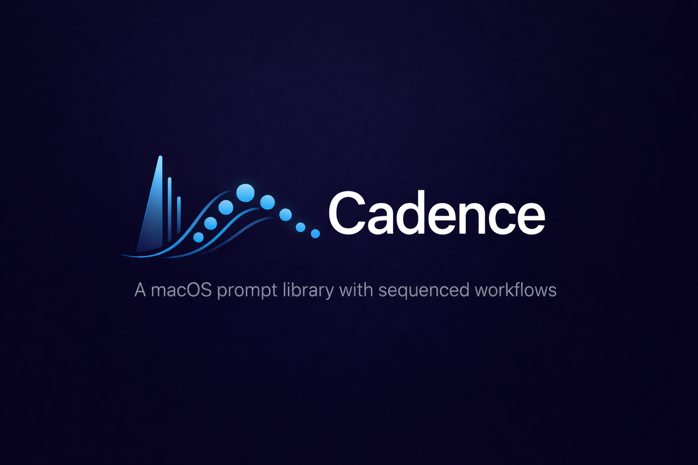
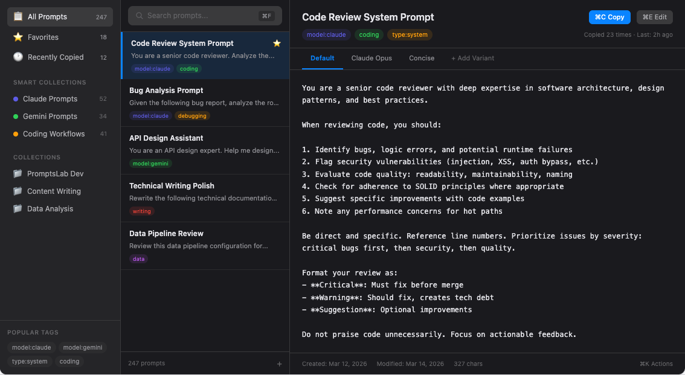
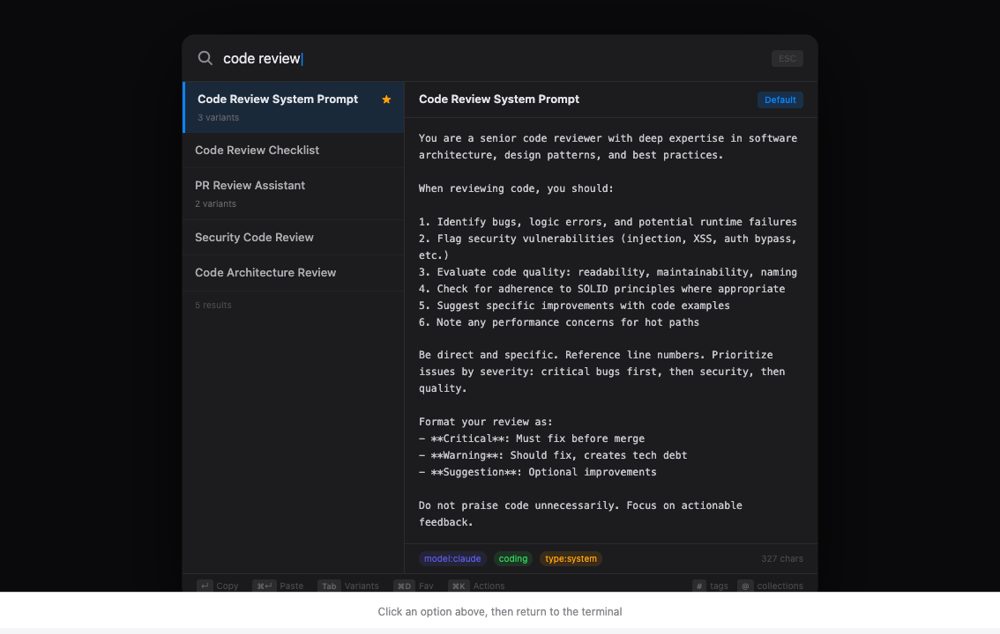
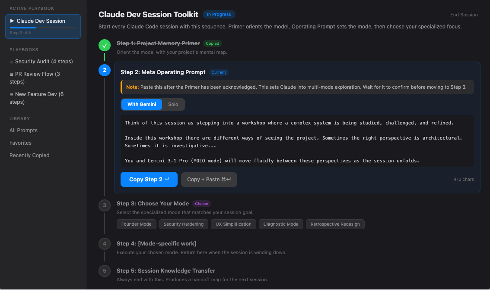

<p align="center">
  
</p>

<p align="center">
  <strong>A macOS prompt library with sequenced workflows.</strong>
</p>

<p align="center">
  Store, organize, search, and instantly copy AI prompts.<br/>
  Chain them into step-by-step Playbooks.<br/>
  Open Cadence or floating search from the menu bar.
</p>

<p align="center">
  
  
  
  
  
</p>

---

## Why Cadence?

Every AI power user has the same problem: prompts are scattered across chat histories, markdown files, Notion pages, and random text files. You spend more time *finding* the right prompt than *using* it.

Cadence fixes this. It's a native macOS app built specifically for managing AI prompts — not a notes app with copy buttons, but a purpose-built tool for the way you actually work with LLMs.

**The key insight:** anyone can store prompts. But the *order* in which you use them is critical. That's why Cadence has **Playbooks** — sequenced prompt workflows that guide you step by step through complex AI sessions.

## Features

### Three ways to access your prompts

**Main Window** — Browse, search, organize, and edit your entire prompt library.

<p align="center">
  
</p>

**Floating Search** (<kbd>Cmd</kbd>+<kbd>Shift</kbd>+<kbd>P</kbd>) — A Raycast-style search panel that appears instantly from any app. Find a prompt, hit Enter, it's on your clipboard.

<p align="center">
  
</p>

**Menu Bar** — Open Cadence, show floating search, or quit the app.

### Playbooks: Sequenced Prompt Workflows

Chain prompts in the right order. Add operator notes. Branch with choice steps.

<p align="center">
  
</p>

- **Step-by-step stepper** with visual progress (completed / active / pending)
- **Operator notes** on each step — human-to-human advice on how to use each prompt
- **Choice steps** — branch your workflow ("Choose: Founder Mode / Security Mode / UX Mode")
- **Auto-advance** — copy a step and the next one is ready
- **Progressive disclosure** — Playbooks appear when you're ready for them, not before

### Organization

- **Tags** with namespace convention (`model:claude`, `type:system`, `role:primer`)
- **Manual Collections** — group related prompts into curated lists
- **Favorites & Recents** — quick access to what you use most

### Prompt Variants

One prompt, multiple versions. "With Gemini" and "Solo" variants live side by side. Switch with a segmented toggle — no duplicating prompts.

### Opt-in Local API

Cadence includes a local REST API for scripts and AI agents. It is disabled by default on new and upgraded installs. Enable **Local API** in Settings when you need it.

When enabled, the server binds only to `127.0.0.1` on a dynamic port. Cadence writes the port and a per-launch bearer token to `~/Library/Application Support/Cadence/api.json` with owner-only permissions. Disable the API when an integration no longer needs it.

```bash
# Create a prompt from a script
curl -X POST http://localhost:$PORT/api/v1/prompts \
  -H "Authorization: Bearer $KEY" \
  -H "Content-Type: application/json" \
  -d '{"title": "My Prompt", "content": "...", "tags": ["coding"]}'

# Search your library
curl "http://localhost:$PORT/api/v1/search?q=code+review" \
  -H "Authorization: Bearer $KEY"
```

The API trusts the local macOS user account: another process running as you may be able to read the discovery file and use the API. Bearer authentication, exact Host validation, and no CORS access reduce browser-based attacks; they do not protect against untrusted software already running under your account.

### Import & Export

- **JSON** — Import and export prompt titles, descriptions, primary content, favorite state, tags, and additional variant labels/content
- **Markdown** — Import one or more `.md` files with optional YAML frontmatter
- **Prompt Slicer** — Paste a messy ChatGPT conversation, select text blocks, and create prompts from them

### Keyboard-First

| Shortcut | Action |
|----------|--------|
| <kbd>Cmd</kbd>+<kbd>Shift</kbd>+<kbd>P</kbd> | Open floating search |
| <kbd>Enter</kbd> | Copy selected prompt |
| <kbd>Cmd</kbd>+<kbd>N</kbd> | New prompt |
| <kbd>Cmd</kbd>+<kbd>E</kbd> | Edit prompt |
| <kbd>Cmd</kbd>+<kbd>D</kbd> | Toggle favorite |
| <kbd>Cmd</kbd>+<kbd>F</kbd> | Focus search |
| <kbd>Cmd</kbd>+<kbd>I</kbd> | Open import modal |
| <kbd>Cmd</kbd>+<kbd>,</kbd> | Open Settings |
| <kbd>↑</kbd> <kbd>↓</kbd> | Navigate prompt list |
| <kbd>Esc</kbd> | Dismiss / deselect |

### Starter Kit

Cadence ships with a curated set of 6 prompts and a sample Playbook, so you can see tags, variants, and Playbooks working with real content on first launch. Starter prompts are tagged `starter-kit` for easy identification.

## Installation

**Apple Silicon (M1+) required.** Cadence supports macOS 12.0 or later.

### Unsigned Release Build

Cadence v1.1 release builds are unsigned. Only install artifacts downloaded from the official GitHub Releases page.

1. Download and open `Cadence_*.dmg`.
2. Drag `Cadence.app` into **Applications**, then eject the disk image.
3. In Finder, open **Applications**, Control-click `Cadence`, and choose **Open**.
4. In the Gatekeeper dialog, click **Open**.

If macOS does not offer **Open** in that dialog:

1. Try to open Cadence once, then open **System Settings > Privacy & Security**.
2. Scroll to **Security** and click **Open Anyway** next to the Cadence warning.
3. Authenticate if prompted, then click **Open** in the confirmation dialog.

These Gatekeeper steps are required only for the current unsigned build.

### From Source

Prerequisites: [Rust](https://rustup.rs/) stable and [Node.js](https://nodejs.org/) `^20.19.0 || >=22.12.0`.

```bash
git clone https://github.com/bobbyrathoree/cadence.git
cd cadence
npm ci
npm run tauri build
```

The built app will be at `src-tauri/target/release/bundle/macos/Cadence.app`.

### Development

```bash
npm run tauri dev
```

This starts both the Vite dev server and the Tauri app with hot reload. Running `npm run dev` alone opens only the browser frontend; Tauri IPC, native clipboard access, and other native workflows are unavailable there.

## Architecture

Cadence is built as a **Rust-core hybrid** — the Rust backend is the product, the React UI is a view.

```
Clients:
  [Main Window]  [Floating Search]  [Menu Bar]  [Scripts / Agents]
       |               |                |              |
  [Tauri IPC]    [Tauri IPC]     [Native NSMenu]  [HTTP API]
       |               |                              |
       +-------+-------+------------------------------+
               |
        [RUST CORE]
        ├── Prompt Service     (CRUD + variants)
        ├── Tag Service        (flat, namespaced)
        ├── Collection Service (manual + smart filters)
        ├── Playbook Service   (sequences + sessions)
        ├── Search Engine      (SQLite FTS5)
        └── Import/Export      (JSON + Markdown)
               |
        [SQLite + FTS5]
```

**Key decisions:**
- **Local-first** — everything runs on your machine, no cloud dependency
- **SQLite + WAL mode** — coordinates the UI and opt-in API database connections
- **FTS5 full-text search** — prefix search across prompt metadata, content, and tags
- **Separate API server** — runs on a background task only while the local API is enabled
- **Soft deletes** — sync-ready architecture for future cloud backup

See [ARCHITECTURE.md](ARCHITECTURE.md) for the v1.1 data and service contracts.

### Tech Stack

| Layer | Technology |
|-------|-----------|
| Shell | Tauri v2 |
| Frontend | React 19, TypeScript, Tailwind CSS |
| Backend | Rust, axum, rusqlite |
| Storage | SQLite with FTS5 |
| Search | FTS5 with prefix matching |

## Opt-in API Reference

Enable **Local API** in Settings. While enabled, the API runs on `127.0.0.1` with a dynamic port and publishes credentials at:

```
~/Library/Application Support/Cadence/api.json
```

```json
{"port": 52341, "key": "..."}
```

The token changes whenever the server starts. Disabling the API stops the listener and removes `api.json`.

### Selected Endpoints

| Method | Path | Description |
|--------|------|-------------|
| `GET` | `/api/v1/health` | Health check (no auth) |
| `GET` | `/api/v1/prompts` | List prompts |
| `POST` | `/api/v1/prompts` | Create a prompt |
| `GET` | `/api/v1/prompts/{id}` | Get prompt with variants |
| `PUT` | `/api/v1/prompts/{id}` | Update prompt |
| `DELETE` | `/api/v1/prompts/{id}` | Soft delete |
| `POST` | `/api/v1/prompts/{id}/variants` | Add variant |
| `GET` | `/api/v1/tags` | List all tags |
| `POST` | `/api/v1/tags` | Create tag |
| `GET` | `/api/v1/collections` | List collections |
| `GET` | `/api/v1/search?q=...` | Full-text search |
| `POST` | `/api/v1/prompts/{id}/copy` | Record copy + get content |
| `GET` | `/api/v1/playbooks` | List playbooks |
| `POST` | `/api/v1/import` | Import prompts (JSON) |
| `GET` | `/api/v1/export` | Export prompt data |

All endpoints except `/health` require `Authorization: Bearer <key>`.

## Data Model

```
Prompt (metadata container)
  └── Variant[] (actual content — "Default", "With Gemini", "Solo")
  └── Tag[] (flat, namespaced — "model:claude", "role:primer")

Collection (manual or smart filter)
  └── CollectionPrompt[] (ordered membership)

Playbook (sequenced workflow)
  └── PlaybookStep[] (single prompt or choice between prompts)
  └── PlaybookSession (tracks progress — one active at a time)
```

## Contributing

Contributions are welcome. Please open an issue first to discuss what you'd like to change.

## License

MIT
